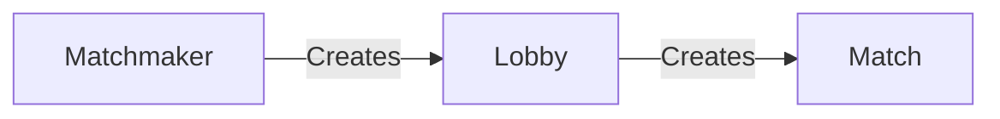

# Gauntlet
## _A 3rd party matchmaking service for Overwatch_

## Features

- Queue System
- ELO System
- In Depth Stats and leaderboards

## Tech

We Currently Use:

- [Flask] - Web Framework
- [MongoDB] - Database and User Storage
- [Discord] - Login/Auth and Discord Server Integration

## Matchmaking Functions

Matchmaker creates a lobby, we put that in the db to hold on to it, when the match is over, and the score is reported, that lobby object creates a match object and adds it to the db, and removes itself from from the db

## Credits
### Developers
- Katte (Website/Backend)
- Archangel (Discord Bot)
- Rockcrafts (Website/Frontent)
